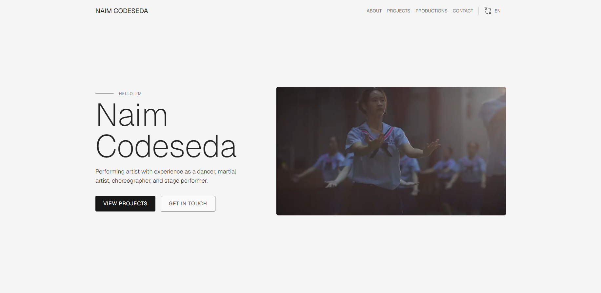

#  Naim Codeseda Portfolio 🚀

A modern, multilingual portfolio website showcasing the work and expertise of Naim Codeseda - a software engineer and designer based in Spain.



## ✨ Features

- 🌍 **Multilingual Support** - English and Spanish versions
- 📱 **Responsive Design** - Optimized for all devices
- 🎨 **Modern UI/UX** - Clean, professional design with smooth animations
- 📁 **CMS Integration** - PayloadCMS for easy content management
- 🎬 **Video Productions** - Dedicated section for video work
- 📧 **Contact Form** - Integrated contact system with email functionality
- 🚀 **Performance Optimized** - Built with Next.js 15 for optimal performance
- 🎭 **Smooth Animations** - Motion library for engaging user experience

## 🛠️ Tech Stack

- **Frontend**: Next.js 15, React 19, TypeScript
- **Styling**: Tailwind CSS 4
- **CMS**: PayloadCMS with PostgreSQL
- **Database**: Supabase
- **Animations**: Motion library
- **Forms**: React Hook Form with Zod validation
- **Deployment**: Vercel-ready configuration

## 🚀 Getting Started

### Prerequisites

- Node.js 18+
- pnpm (recommended) or npm
- PostgreSQL database (via Supabase)

### Installation

1. **Clone the repository**

   ```bash
   git clone <your-repo-url>
   cd naim
   ```

2. **Install dependencies**

   ```bash
   pnpm install
   ```

3. **Environment Setup**
   Create a `.env.local` file with your configuration:

   ```env
   DATABASE_URL=your_postgres_connection_string
   PAYLOAD_SECRET=your_payload_secret
   # Add other required environment variables
   ```

4. **Database Setup**

   ```bash
   pnpm payload:generate:types
   ```

5. **Run Development Server**

   ```bash
   pnpm dev
   ```

6. **Build for Production**
   ```bash
   pnpm build
   pnpm start
   ```

## 📁 Project Structure

```
src/
├── app/                    # Next.js app router
│   ├── (app)/            # Main application routes
│   │   ├── (index)/      # Homepage with portfolio sections
│   │   └── _layout-resources/  # Navigation and layout components
│   └── (payload)/        # PayloadCMS admin panel
├── collections/           # PayloadCMS collection definitions
├── shared/               # Reusable components and utilities
│   ├── components/       # UI components
│   ├── types/           # TypeScript type definitions
│   └── utils/           # Utility functions
└── lib/                  # Library configurations
```

## 🎯 Key Sections

- **Introduction** - Hero section with personal branding
- **About Me** - Professional background and expertise
- **Projects** - Showcase of selected works
- **Productions** - Video and media productions
- **Contact** - Professional contact information and form
- **Footer** - Additional links and information

## 🌐 Multilingual Support

The portfolio supports both English and Spanish languages, automatically detecting user preferences and providing localized content through PayloadCMS.

## 📱 Responsive Design

Built with a mobile-first approach using Tailwind CSS, ensuring optimal viewing experience across all devices and screen sizes.

## 🚀 Deployment

The project is configured for easy deployment on Vercel with optimized build settings and environment variable support.

